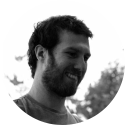
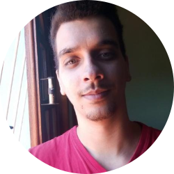
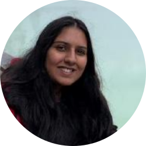

<!--
-------------------------------------------------------------------------------
This file defines the contents of each slide.
The reveal.js configuration can be found in index.html
-------------------------------------------------------------------------------
-->

<!-- .slide: class="slide-title" data-background-image="assets/title-slide.svg" data-background-color="#000000" data-background-size="contain" -->

<!-- Place the content at the bottom of the slide -->

<h1 id="talk-title">
  Memorial
</h1>
<h2 id="talk-subtitle">
Concurso público para
Professor Doutor em Métodos Potenciais
 
Edital ATAc-IAG/044/2022
</h2>

  <a href="https://www.leouieda.com" id="talk-speaker">Leonardo Uieda</a>

<!-- Place location and date side-by-side with affiliation logos -->

<i class="fa fa-calendar-alt" style="margin: 0 10px 0 0"></i>
Abril 2023

Departamento de Geofísica - IAG - Universidade de São Paulo

<!-- Permission to reuse and CC-BY license logo -->
<i class="fa fa-camera" style="margin: 0 10px 0 0"></i>
Feel free to screenshot/share/reuse this presentation

<a href="https://creativecommons.org/licenses/by/4.0/"><i class="fab fa-creative-commons"></i><i class="fab fa-creative-commons-by" style="margin: 0 10px 0 2px"></i>CC-BY 4.0 License</a>

<!-- Add logos here. Need these wrappers to align them to the bottom right -->

  

===============================================================================

<!-- .slide: data-background-image="assets/timeline-usp.png" data-background-color="#000000" data-background-size="contain" -->

===============================================================================

<!-- .slide: data-background-image="assets/timeline-york.png" data-background-color="#000000" data-background-size="contain" -->

===============================================================================

<!-- .slide: data-background-image="assets/timeline-msc.png" data-background-color="#000000" data-background-size="contain" -->

===============================================================================

<!-- .slide: data-background-image="assets/timeline-trieste.png" data-background-color="#000000" data-background-size="contain" -->

===============================================================================

<!-- .slide: data-background-image="assets/timeline-phd.png" data-background-color="#000000" data-background-size="contain" -->

===============================================================================

<!-- .slide: data-background-image="assets/timeline-uerj.png" data-background-color="#000000" data-background-size="contain" -->

===============================================================================

<!-- .slide: data-background-image="assets/timeline-uerj-phd.png" data-background-color="#000000" data-background-size="contain" -->

===============================================================================

<!-- .slide: data-background-image="assets/timeline-hawaii.png" data-background-color="#000000" data-background-size="contain" -->

===============================================================================

<!-- .slide: data-background-image="assets/timeline-full.png" data-background-color="#000000" data-background-size="contain" -->

===============================================================================

# Pesquisa

1. <!-- .element: class="fragment" --> Modelagem direta de campos gravitacionais em escala global
1. <!-- .element: class="fragment" --> Inversão 3D em métodos potenciais
1. <!-- .element: class="fragment" --> Determinação da espessura crustal através de distúrbios da gravidade
1. <!-- .element: class="fragment" --> Camada equivalente
1. <!-- .element: class="fragment" --> Deconvolução de Euler
1. <!-- .element: class="fragment" --> Interpolação de dados geofísicos
1. <!-- .element: class="fragment" --> <strong>Modelagem de dados de microscopia magnética</strong>
1. <!-- .element: class="fragment" --> <strong>Fluxo geotermal Antártico através de dados magnetométricos</strong>
1. <!-- .element: class="fragment" --> <strong>Ciência aberta e software livre científico</strong>

===============================================================================

# Ensino

1. <!-- .element: class="fragment" --> 17 cursos de curta duração
1. <!-- .element: class="fragment" --> 10 disciplinas de graduação
1. <!-- .element: class="fragment" --> 4 disciplinas novas
1. <!-- .element: class="fragment" --> Áreas: programação, métodos numéricos, campo, sensoriamento remoto, geologia geral, geodinâmica, inversão
1. <!-- .element: class="fragment" --> <strong>Formação em pedagogia para ensino superior</strong>
1. <!-- .element: class="fragment" --> <strong>Instrutor do Software Carpentry</strong>
1. <!-- .element: class="fragment" --> <strong>Recursos educacionais abertos</strong>

===============================================================================

# Extensão

1. <!-- .element: class="fragment" --> Hour of Code - Honolulu
1. <!-- .element: class="fragment" --> Entrevistas em podcasts
1. <!-- .element: class="fragment" --> Open Days

===============================================================================

# Administração

1. <!-- .element: class="fragment" --> Laboratório de Geofísica de Exploração
1. <!-- .element: class="fragment" --> Projeto QUALITEC
1. <!-- .element: class="fragment" --> Capítulo Estudantil SEG
1. <!-- .element: class="fragment" --> Subcomissão eleitoral
1. <!-- .element: class="fragment" --> Representante <em>Early Career Academics</em>
1. <!-- .element: class="fragment" --> Comissão de modernização do site do departamento
1. <!-- .element: class="fragment" --> <strong>Coordenador dos cursos de geofísica</strong>

===============================================================================

# Ciência aberta

1. <!-- .element: class="fragment" --> Artigos + código livre
1. <!-- .element: class="fragment" --> Tesseroids
1. <!-- .element: class="fragment" --> Fatiando a Terra
1. <!-- .element: class="fragment" --> Generic Mapping Tools + PyGMT
1. <!-- .element: class="fragment" --> <strong>Editor do Journal of Open Source Software</strong>
1. <!-- .element: class="fragment" --> <strong>Advisory Council do EarthArXiv</strong>
1. <!-- .element: class="fragment" --> <strong>Advisory Council do pyOpenSci</strong>
1. <!-- .element: class="fragment" --> <strong>Board Member do Software Underground</strong>

===============================================================================

# Orientações

Liverpool: 11 Graduação + 1 Mestrado

Doutorado:

Santiago Soler

Gelson F. Souza Junior

India Uppal

===============================================================================

# Motivação para voltar

1. <!-- .element: class="fragment" --> Comercialização extrema das instituições estrangeiras
1. <!-- .element: class="fragment" --> Colonialismo científico
1. <!-- .element: class="fragment" --> Qualidade das Universidades brasileiras
1. <!-- .element: class="fragment" --> Alunos brasileiros
1. <!-- .element: class="fragment" --> Choque cultural
1. <!-- .element: class="fragment" --> <strong>Retribuir ao país e ao IAG</strong>

===============================================================================

<!-- .slide: class="slide-contact" data-background-image="assets/contact-slide.svg" data-background-size="contain" data-background-color="#000000" -->

<i class="fas fa-comments"></i>
 
Contato:
<a href="https://www.leouieda.com">www.leouieda.com</a>

<i class="fab fa-github"></i>
 
Código fonte desta apresentação:
 
[github.com/compgeolab/projeto2023](https://github.com/compgeolab/projeto2023)

<i class="fab fa-creative-commons"></i><i class="fab fa-creative-commons-by"></i>
 
Unless otherwise noted,
the contents of this presentation are
licensed under the
 
[Creative Commons Attribution 4.0 International License](https://creativecommons.org/licenses/by/4.0/).

A imagem de fundo mostra a região Oeste de São Paulo.
Dados são provenientes do satélite Landsat 9.
A imagem foi produzida com o software
[xlandsat](https://www.compgeolab.org/xlandsat/).

